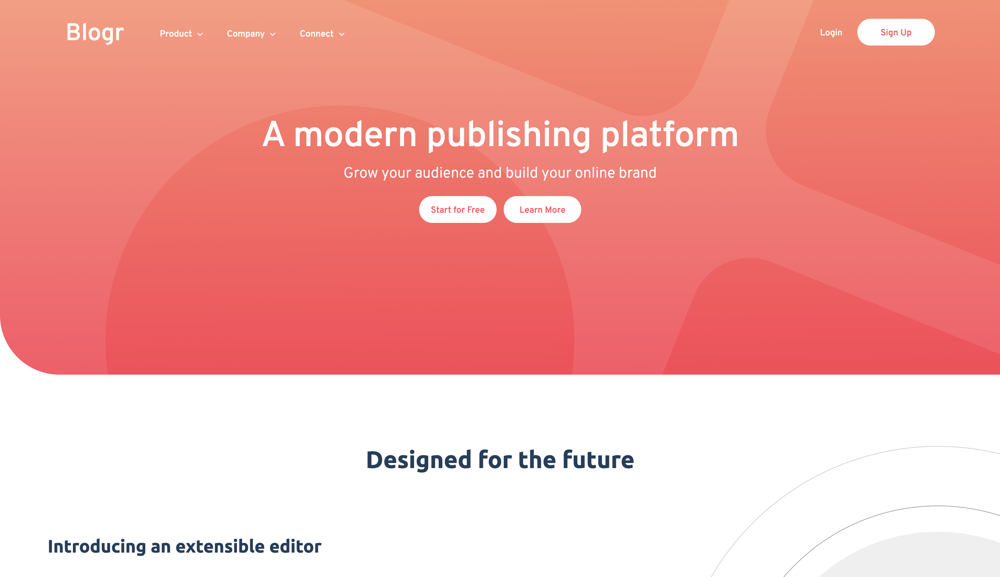

# Frontend Mentor - Blogr landing page solution

This is a solution to the [Blogr landing page challenge on Frontend Mentor](https://www.frontendmentor.io/challenges/blogr-landing-page-EX2RLAApP). Frontend Mentor challenges help you improve your coding skills by building realistic projects.

## Table of contents

- [Overview](#overview)
  - [The challenge](#the-challenge)
  - [Screenshot](#screenshot)
  - [Links](#links)
- [My process](#my-process)
  - [Built with](#built-with)
  - [What I learned](#what-i-learned)
  - [Continued development](#continued-development)
  - [Useful resources](#useful-resources)
- [Author](#author)

## Overview

### The challenge

Users should be able to:

- View the optimal layout for the site depending on their device's screen size
- See hover states for all interactive elements on the page

### Screenshot



### Links

- Solution URL: [Click me!](https://github.com/axseinga/blogr-landing-page)
- Live Site URL: [Add live site URL here](https://axseinga.github.io/blogr-landing-page/)

## My process

### Built with

- Semantic HTML5 markup
- CSS custom properties
- SASS
- Flexbox
- BEM pattern
- Desktop-first workflow
- vanilla Javascript

### What I learned

I learned a lot during working on this project. I had to come back to many lessons and tutorials from courses I took to refresh my knowledge. What was challenging for me is positioning elements on the websites and creating media queries. I created four breakpoints to adjust to as many screens as possible and it took a lot of time and tests. I learned how to display dropdown menu only using CSS and how to create a mobile menu using vanilla Javascript. The most challenging part was to create a mobile menu button and toggle between images.

I am super happy that I managed to make it work even when it took some time to figure out. By this single feature I learned to better understand Javascript.

```js
openMenu.addEventListener("click", function () {
  menu.classList.toggle("hidden");
  toggleImage(
    ".ham-img",
    "./images/icon-hamburger.svg",
    "./images/icon-close.svg"
  );
});

const toggleImage = function (img, open, close) {
  let imgSrc = document.querySelector(img);
  if (imgSrc.src.match(open)) {
    document.querySelector(img).src = close;
  } else {
    document.querySelector(img).src = open;
  }
```

### Continued development

I still find it difficult sometimes to position elements and how they interact between each other. Sometimes, especially when starting to design the website from desktop view, setting some properties on elements causes the website to resize in funny ways and it takes a lot of time to fix it. I will continue to learn about CSS and responsiveness. I will keep reading about the BEM pattern because it is still very confusing sometimes.

### Useful resources

- [Jonas' Schmedtmann course: Advanced CSS and Sass: Flexbox, Grid, Animations and More ](https://www.example.com) - This course is a gem. Coming back to some lessons really helped me build this project.
- [MDN Web Docs](https://developer.mozilla.org/en-US/) - MDN documentation is the best when it comes to explaining properties in CSS.
- [CSS-TRICKS](https://css-tricks.com/) - Another genius website that helps with all the tricks with CSS that one might need. Especially when it comes to Flexbox and Grid!
- [Frontend Mentor: FAQ accordion card](https://www.frontendmentor.io/challenges/faq-accordion-card-XlyjD0Oam) - By doing this challenge before I jumped to more advanced challenges helped me first to build some features in javascript by myself and then reuse them when I recognised similarity.
- [Javascript](https://users.aber.ac.uk/ruw/misc/swapimage.php) - I got stuck and had a hard time to figure out how to toggle the image of the hamburger. I tried multiple ways, but none seemed to work. I searched the Internet and Stackoverflow but still I couldn't find a solution that fit my needs. This code for swapping image worked like charm!

## Author

- Github - [Axseinga](https://github.com/axseinga)
- Frontend Mentor - [Axseinga](https://www.frontendmentor.io/profile/axseinga)
